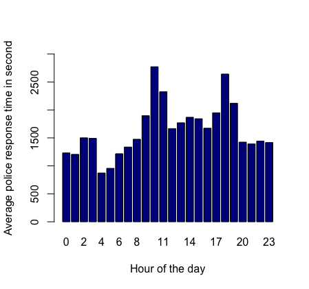
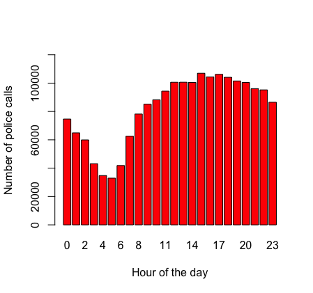
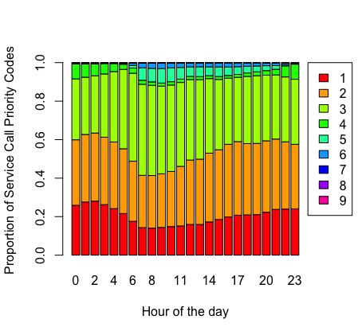

# Seattle-s-911-incidence-response-activity

Living in large cities is highly associated with experiencing higher crime rates in compared with small cities or rural areas. Therefore, understanding police response time and frequency of call for police service based on the associated incident, time of occurrence, city area, and other related factors can increase the residents’ awareness and help the police department to stay informed and increase the chance of preventing them. 

As a major city in the United States, Seattle has an overall crime rate of 115% higher than the national average. For every 100,000 people, there are 16.14 daily crimes occurring in Seattle, which places Seattle safer than 7% of the cities in the United States. 

For this project, Seattle’s 911 incidence response activity database is used (https://data.seattle.gov/Public-Safety/Call-Data/33kz-ixgy), which provides information regarding all officers dispatched to 911 calls from year 2001 to present in Seattle. 
This data represents police response activity and each row is a record of a Call for Service (CfS) logged with the Seattle Police Department (SPD) Communications Center. Calls originated from the community and range from in progress or active emergencies to requests for problem solving. Additionally, officers log calls from their observations of the field. These data are queried from the Data Analytics Platform (DAP) and updated incrementally on a daily basis. 

The end goal of this project can be divided into two parts. First, the factors that impact police response time due to a service call in Seattle will be detected to improve the chance of addressing an incidence in time. Secondly, by analysis of associated incidence types, a prediction model using random forest approach can be developed to predict the chance of an incidence type occurring in Seattle, which would increase residents' and authorities' awareness to possible crimes in future. 

## Preliminary Results: 

For the initial analysis, the average police response time at different hours of the day are analyzed. Additionally, police service calls are analyzed based on their incident priority at each hour of the day and the proportion that each priority constitutes the calls in that hour is calculated.

